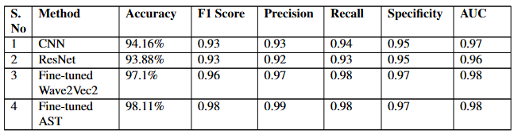
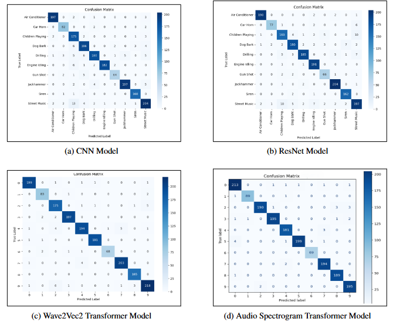
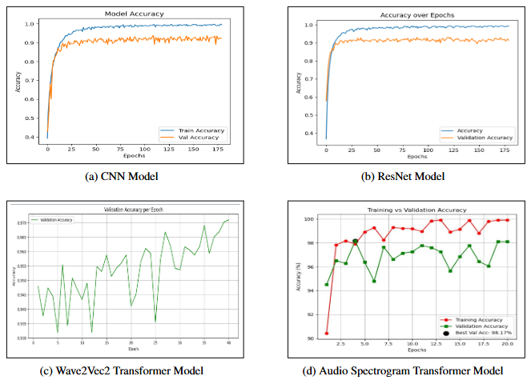
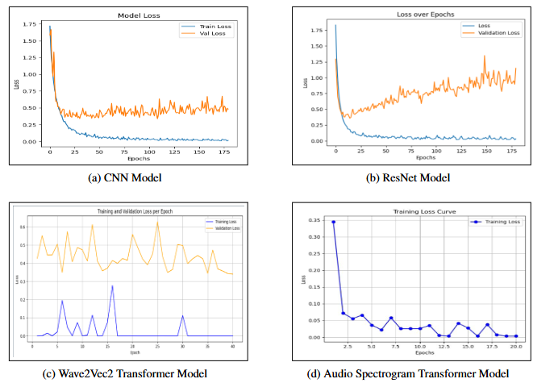
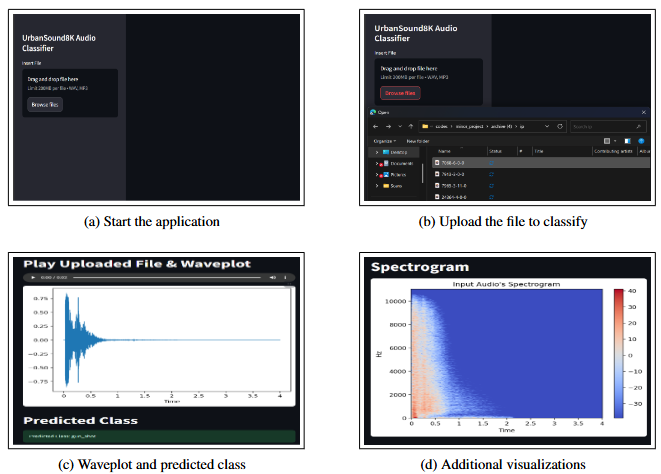

# 🎧 Urban Sound Classification

This project aims to classify urban sound recordings into predefined categories using four deep learning models: **CNN**, **ResNet**, **Wave2Vec2**, and **AST (Audio Spectrogram Transformer)**. We compare their performances using multiple metrics and deploy a Streamlit web application for real-time predictions.

---

## 📌 Table of Contents

- [🎯 Introduction](#-introduction)
- [📁 Dataset](#-dataset)
- [🛠️ Technologies Used](#-technologies-used)
- [📊 Performance Comparison](#-performance-comparison)
- [📈 Confusion Matrices](#-confusion-matrices)
- [🧪 Training & Testing Accuracy Graphs](#-training--testing-accuracy-graphs)
- [🧪 Training & Testing Loss Graphs](#-training--testing-loss-graphs)
- [🖥️ Web App Screenshots](#-web-app-screenshots)
- [📄 Project Report](#-project-report)

---

## 🎯 Introduction

Urban environments are full of distinctive sounds—car horns, sirens, dog barks, drilling, etc. This project leverages deep learning techniques to classify such environmental audio samples from the **UrbanSound8K dataset**. The system can aid in **smart city solutions**, **noise pollution analysis**, and **automatic tagging systems**.

---

## 📁 Dataset

- **UrbanSound8K**: 8732 labeled audio clips (≤4s) from 10 urban classes.  
- [Download Link](https://urbansounddataset.weebly.com/urbansound8k.html)  
- Classes: air_conditioner, car_horn, children_playing, dog_bark, drilling, engine_idling, gun_shot, jackhammer, siren, street_music  
- Preprocessing: MFCC, Mel-spectrogram, zero-padding

---

## 🛠️ Technologies Used

- **Languages**: Python  
- **Audio**: Librosa, SoundFile  
- **Models**: TensorFlow, PyTorch, Hugging Face Transformers  
- **Visualization**: Matplotlib, Seaborn  
- **Web App**: Streamlit  
- **Other**: NumPy, Pandas, OpenCV

---

The models evaluated:
- 🔷 CNN (1D)
- 🟩 ResNet (on Mel-spectrograms)
- 🟪 Wave2Vec2 (Facebook’s pretrained speech model)
- 🟨 AST (Audio Spectrogram Transformer)

---

## 📊 Performance Comparison

---

## 📈 Confusion Matrices

---

## 🧪 Training & Testing Accuracy Graphs

---

## 🧪 Training & Testing Loss Graphs

---

## 🖥️ Web App Screenshots

---

## 📄 Project Report

The complete report detailing:
- Data preprocessing techniques (e.g., MFCC, Mel-Spectrograms)
- Model architecture for each approach
- Training parameters (batch size, optimizer, loss)
- Evaluation metrics (confusion matrix, precision, recall, F1)
- Challenges and future improvements

📄 **[Download Report (PDF)](https://drive.google.com/file/d/11fzHFheMiMHPoa5fUgXUtKWEmnHu1PKq/view?usp=drive_link)**

---

